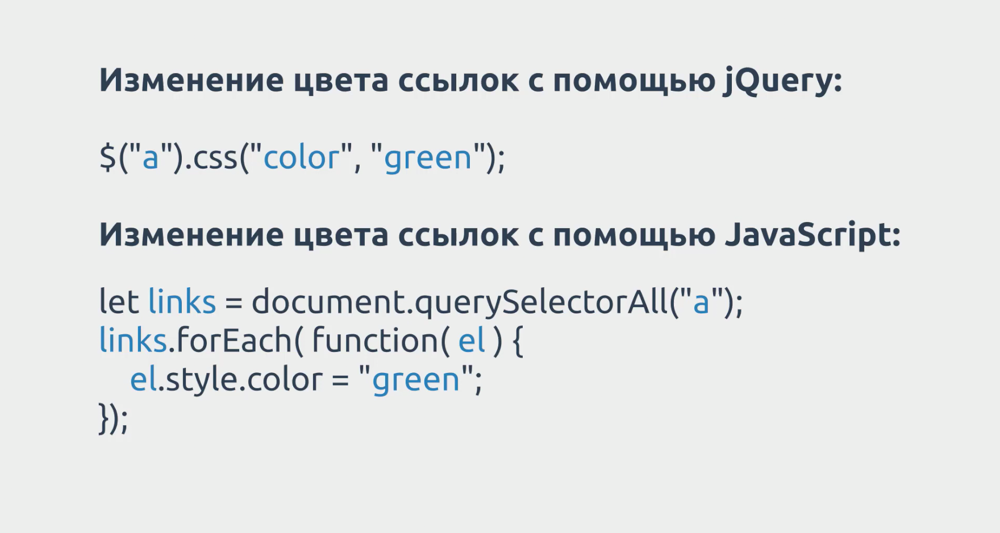
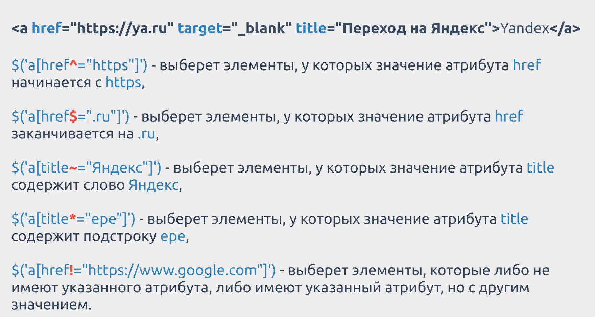
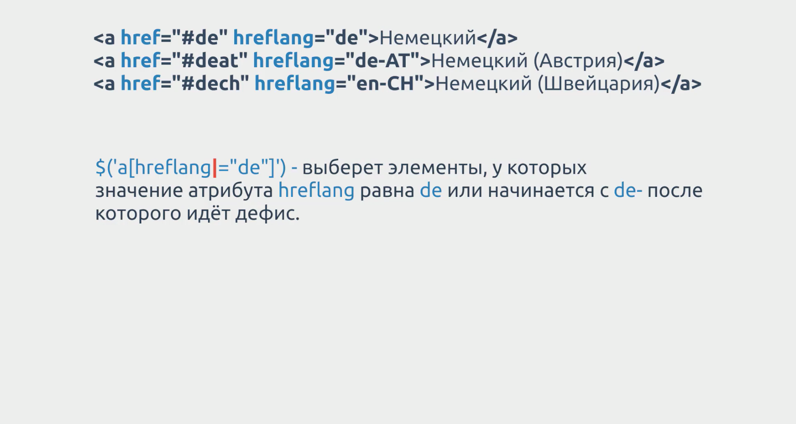
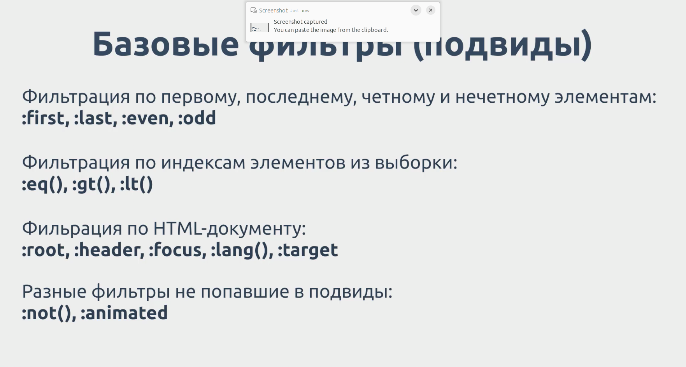

# [gabdr0](https://www.youtube.com/@gabdr0)

gabdr0 - YouTube-канал посвящен верстке и созданию сайтов

На данный момент есть уроки по Sublime Text 3, Bootstrap 4 и jQuery.

Курс на Stepik: [stepik.org](https://stepik.org/134100)

## jQuery-2024
Курс по jQuery от А до Я. Уроки библиотеки jQuery для начинающих.

Ссылка на видео курс: [YouTube](https://www.youtube.com/watch?v=vPnom5AiD1w&list=PLfe1kRw3wJm1THSnShR473hltjgt2Li8y)

